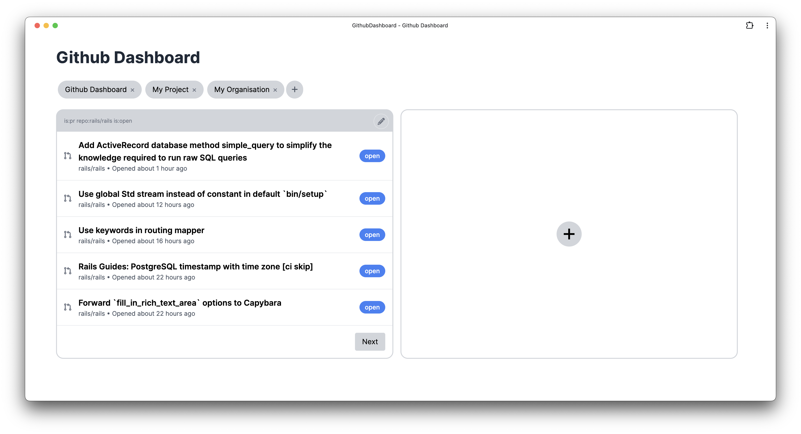
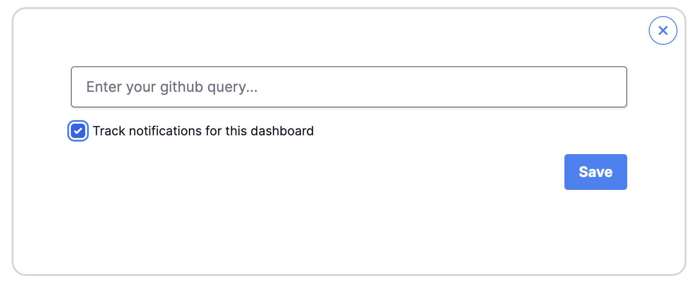

  

# Github Dashboard
A Progressive Web App (PWA) that transforms how you interact with GitHub by providing a customizable dashboard with desktop notifications. This app streamlines your GitHub workflow through two powerful features:

  

# 🚀 Overview

### 1. Quick Links
Customize your top navigation bar with shortcuts to any GitHub pages you frequently visit. Whether it's your team's project board, your organization's repositories, or your favorite discussion forums - keep them all just one click away.

### 2. Custom Query Feeds (Dashboards)
Harness the power of GitHub's search syntax to create personalized notification feeds.

#### Example Queries:
- 📬 Stay on top of notifications with `notifications is:unread`
- 👀 Monitor incoming review requests with `is:pr requested-review:<your-username>`
- ✅ Track issues assigned to you with `is:issue assignee:<your-username>`
- 📊 Follow specific repository activity with `repo:<owner>/<repo> is:open`
- 👥 Watch team mentions with `team:<org>/<team-name>`

## 🔔 Badge Notifications

Each dashboard can be configured to show badge notifications, allowing you to monitor the count of items matching your queries right from your browser.

  

- 🔄 See how many pull requests need your review
- 📱 Track the number of unread notifications  
- 📋 Monitor the count of open issues assigned to you

These badge notifications update automatically, ensuring you never miss important updates without having to constantly check GitHub.
